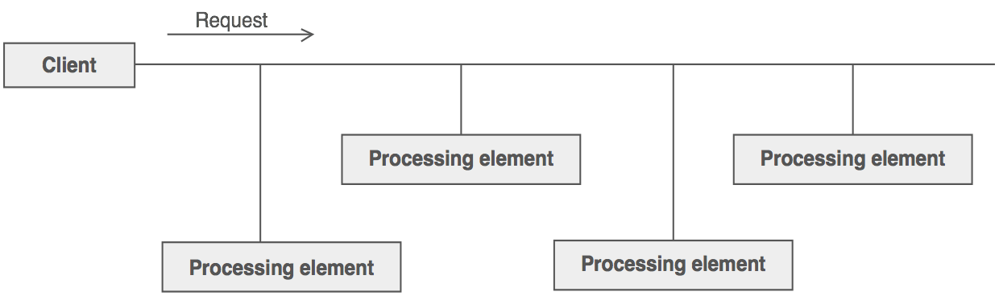
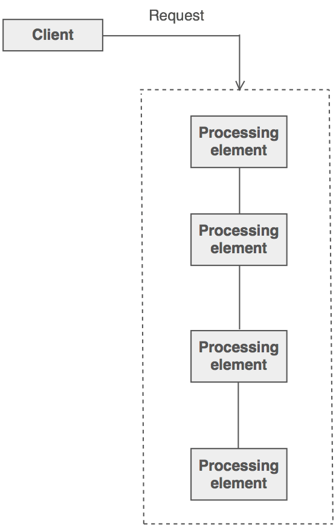
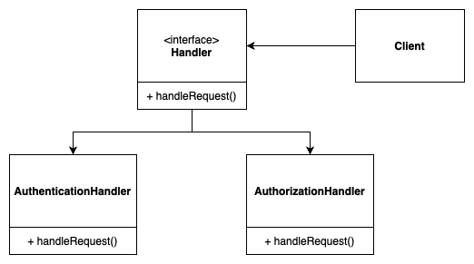

# Chain of Responsibility
**aka CoR, Chain of Command**

## Table of Contents

* [Intent](#intent)
* [Problem](#problem)
* [Solution](#solution)
* [Structure](#structure)
* [Implementation Diagram](#implementation-diagram)
* [Applicability](#applicability)

## Intent

**Chain of Responsibility** is a behavioral design pattern that lets you pass requests along a chain of handlers. Upon receiving a request, each handler decides either to process the request or to pass it to the next handler in the chain.

## Problem

There is a potentially variable number of "handler" or "processing element" or "node" objects, and a stream of requests that must be handled. Need to efficiently process the requests without hard-wiring handler relationships and precedence, or request-to-handler mappings.

## Solution

Encapsulate the processing elements inside a "pipeline" abstraction; and have clients "launch and leave" their requests at the entrance to the pipeline.

The pattern chains the receiving objects together, and then passes any request messages from object to object until it reaches an object capable of handling the message. The number and type of handler objects isn't known a priori, they can be configured dynamically. The chaining mechanism uses recursive composition to allow an unlimited number of handlers to be linked.

Chain of Responsibility simplifies object interconnections. Instead of senders and receivers maintaining references to all candidate receivers, each sender keeps a single reference to the head of the chain, and each receiver keeps a single reference to its immediate successor in the chain.

**Do not** use Chain of Responsibility when each request is only handled by one handler, or, when the client object knows which service object should handle the request.

## Structure

1. The **Handler** declares the interface, common for all concrete handlers. It usually contains just a single method for handling requests, but sometimes it may also have another method for setting the next handler on the chain.
2. The **Base Handler** is an *optional* class where you can put the boilerplate code that’s common to all handler classes.
   Usually, this class defines a field for storing a reference to the next handler.

3. **Concrete Handlers** contain the actual code for processing requests. Upon receiving a request, each handler must decide whether to process it and, additionally, whether to pass it along the chain.
4. The **Client** may compose chains just once or compose them dynamically, depending on the application’s logic. Note that a request can be sent to any handler in the chain—it doesn’t have to be the first one.

## Implementation Diagram

## Applicability
Use Cor:
- When you need to perform sequential operations before reaching a specific object;
- When there are multiple levels of escalation to different handlers.

