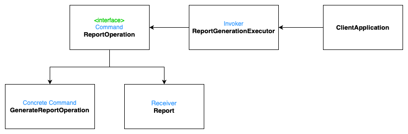

# Command
**aka Action, Transaction**

## Table of Contents

* [Intent](#intent)
* [Problem](#problem)
* [Solution](#solution)
* [Structure](#structure)
* [Implementation Diagram](#implementation-diagram)
* [Applicability](#applicability)

## Intent

**Command** is a behavioral design pattern that turns a request into a stand-alone object that contains all information about the request. This transformation lets you pass requests as a method arguments, delay or queue a request’s execution, and support undoable operations.

## Problem

Need to issue requests to objects without knowing anything about the operation being requested or the receiver of the request.

## Solution

Command decouples the object that invokes the operation from the one that knows how to perform it. To achieve this separation, the designer creates an abstract base class/interface that maps a receiver (an object) with an action (a pointer to a member function). The base class contains an ```execute()``` method that simply calls the action on the receiver.

All clients of Command objects treat each object as a "black box" by simply invoking the object's virtual ```execute()``` method whenever the client requires the object's "service".

A Command class holds some subset of the following: an object, a method to be applied to the object, and the arguments to be passed when the method is applied. The Command's "execute" method then causes the pieces to come together.

Sequences of Command objects can be assembled into composite (or macro) commands.

As a result, commands become a convenient middle layer that reduces coupling between, for example, the GUI and business logic layers.

## Structure


1. The **Sender** class (aka *invoker*) is responsible for initiating requests. This class must have a field for storing a reference to a command object. The sender triggers that command instead of sending the request directly to the receiver.
2. The **Command** interface usually declares just a single method for executing the command.
3. **Concrete Commands** implement various kinds of requests. A concrete command isn’t supposed to perform the work on its own, but rather to pass the call to one of the business logic objects.
4. The **Receiver** class contains some business logic. Almost any object may act as a receiver. Most commands only handle the details of how a request is passed to the receiver, while the receiver itself does the actual work.
5. The **Client** creates and configures concrete command objects. The client must pass all of the request parameters, including a receiver instance, into the command’s constructor. After that, the resulting command may be associated with one or multiple senders.

## Implementation Diagram



## Applicability
Use Command:
- When you want to parametrize objects with operations;
- When you want to queue operations, schedule their execution, or execute them remotely;
- When you want to implement reversible operations.

