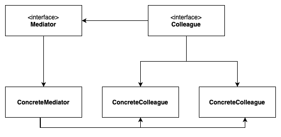

# Mediator
**aka Intermediary, Controller**

## Table of Contents

* [Intent](#intent)
* [Problem](#problem)
* [Solution](#solution)
* [Structure](#structure)
* [Implementation Diagram](#implementation-diagram)
* [Applicability](#applicability)

## Intent

**Mediator** is a behavioral design pattern that lets you reduce chaotic dependencies between objects. The pattern restricts direct communications between the objects and forces them to collaborate only via a mediator object.

## Problem

We want to design reusable components, but dependencies between the potentially reusable pieces demonstrates the "spaghetti code" phenomenon (trying to scoop a single serving results in an "all or nothing clump").

## Solution

The Mediator pattern suggests that you should cease all direct communication between the components which you want to make independent of each other. Instead, these components must collaborate indirectly, by calling a special mediator object that redirects the calls to appropriate components. As a result, the components depend only on a single mediator class instead of being coupled to dozens of their colleagues.

This way, the Mediator pattern lets you encapsulate a complex web of relations between various objects inside a single mediator object. The fewer dependencies a class has, the easier it becomes to modify, extend or reuse that class.

## Structure

1. **Components** are various classes that contain some business logic. Each component has a reference to a mediator, declared with the type of the mediator interface.
2. The **Mediator** interface declares methods of communication with components, which usually include just a single notification method.
3. **Concrete Mediators** encapsulate relations between various components. Concrete mediators often keep references to all components they manage and sometimes even manage their lifecycle.
4. Components must not be aware of other components. If something important happens within or to a component, it must only notify the mediator. When the mediator receives the notification, it can easily identify the sender, which might be just enough to decide what component should be triggered in return.

## Implementation Diagram

## Applicability
Use the Mediator:
- When having too many relationships between objects;
- When communication between objects is too complex.

