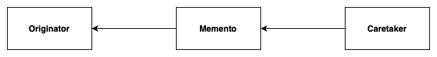

# Memento
**aka Snapshot**

## Table of Contents

* [Intent](#intent)
* [Problem](#problem)
* [Solution](#solution)
* [Structure](#structure)
* [Implementation Diagram](#implementation-diagram)
* [Applicability](#applicability)

## Intent

**Memento** is a behavioral design pattern that lets you save and restore the previous state of an object without revealing the details of its implementation.

## Problem

Need to restore an object back to its previous state (e.g. "undo" or "rollback" operations).

## Solution

The Memento design pattern defines three distinct roles:

1. *Originator* - the object that knows how to save itself.
2. *Caretaker* - the object that knows why and when the Originator needs to save and restore itself.
3. *Memento* - the lock box that is written and read by the Originator, and shepherded by the Caretaker. Here it is store the copy of the object’s state. (The contents of the memento aren’t accessible to any other object except the one that produced it. Other objects must communicate with mementos using a limited interface which may allow fetching the snapshot’s metadata (creation time, the name of the performed operation, etc.), but not the original object’s state contained in the snapshot.)

## Structure

1. The **Originator** class can produce snapshots of its own state, as well as restore its state from snapshots when needed.
2. The **Memento** is a value object that acts as a snapshot of the originator’s state. It’s a common practice to make the memento immutable and pass it the data only once, via the constructor.
3. The **Caretaker** knows not only “when” and “why” to capture the originator’s state, but also when the state should be restored.
   A caretaker can keep track of the originator’s history by storing a stack of mementos. When the originator has to travel back in history, the caretaker fetches the topmost memento from the stack and passes it to the originator’s restoration method.
4. In this implementation, the memento class is nested inside the originator. This lets the originator access the fields and methods of the memento, even though they’re declared private. On the other hand, the caretaker has very limited access to the memento’s fields and methods, which lets it store mementos in a stack but not tamper with their state.

## Implementation Diagram

- Originator - the object for which we want to perform a snapshot
- Memento - the object that contains the state of the Originator. It's also able to retrieve that state.
- Caretaker - in this class a copy of the state is being saved

## Applicability
Use the Memento:
- When you want to produce snapshots of the object’s state to be able to restore a previous state of the object;
- When direct access to the object’s fields/getters/setters violates its encapsulation.

