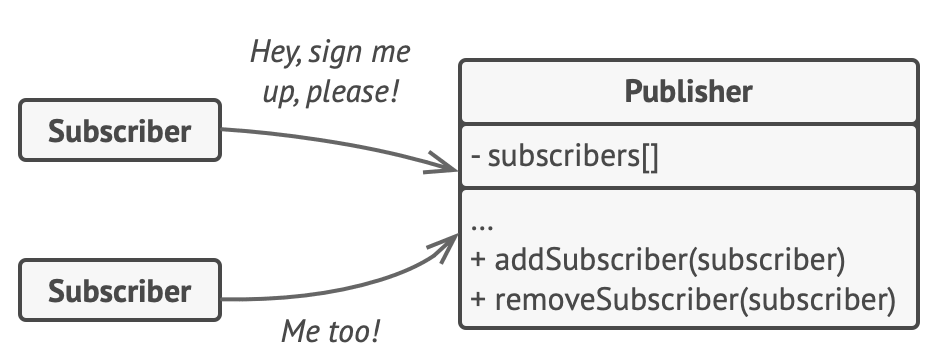
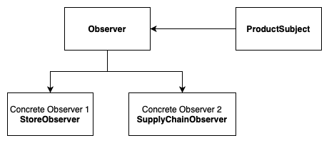

# Observer
**aka Event-Subscriber, Listener**

## Table of Contents

* [Intent](#intent)
* [Problem](#problem)
* [Solution](#solution)
* [Structure](#structure)
* [Implementation Diagram](#implementation-diagram)
* [Applicability](#applicability)

## Intent

**Observer** is a behavioral design pattern that lets you define a subscription mechanism to notify multiple objects about any events that happen to the object they’re observing.
- Define a one-to-many dependency between objects so that when one object changes state, all its dependents are notified and updated automatically.
- Encapsulate the core (or common or engine) components in a Subject abstraction, and the variable (or optional or user interface) components in an Observer hierarchy.
- The "View" part of Model-View-Controller.

## Problem

Imagine that you have two types of objects: a ```Customer``` and a ```Store```. The customer is very interested in a particular brand of product (say, it’s a new model of the iPhone) which should become available in the store very soon.

The customer could visit the store every day and check product availability. But while the product is still en route, most of these trips would be pointless.

On the other hand, the store could send tons of emails (which might be considered spam) to all customers each time a new product becomes available. This would save some customers from endless trips to the store. At the same time, it’d upset other customers who aren’t interested in new products.

It looks like we’ve got a conflict. Either the customer wastes time checking product availability or the store wastes resources notifying the wrong customers.

## Solution

The object that has some interesting state is often called *subject*, but since it’s also going to notify other objects about the changes to its state, we’ll call it *publisher*. All other objects that want to track changes to the publisher’s state are called *subscribers*.

The Observer pattern suggests that you add a subscription mechanism to the publisher class so individual objects can subscribe to or unsubscribe from a stream of events coming from that publisher. 

This mechanism consists of:
1) an array field for storing a list of references to subscriber objects and 
2) several public methods which allow adding subscribers to and removing them from that list.



Now, whenever an important event happens to the publisher, it goes over its subscribers and calls the specific notification method on their objects.

It’s crucial that all subscribers implement the same interface and that the publisher communicates with them only via that interface. This interface should declare the notification method along with a set of parameters that the publisher can use to pass some contextual data along with the notification.

## Structure


1. The **Publisher** issues events of interest to other objects. These events occur when the publisher changes its state or executes some behaviors. Publishers contain a subscription infrastructure that lets new subscribers join and current subscribers leave the list.
2. When a new event happens, the publisher goes over the subscription list and calls the notification method declared in the subscriber interface on each subscriber object.
3. The **Subscriber** interface declares the notification interface. In most cases, it consists of a single ```update``` method. The method may have several parameters that let the publisher pass some event details along with the update.
4. **Concrete Subscribers** perform some actions in response to notifications issued by the publisher. All of these classes must implement the same interface so the publisher isn’t coupled to concrete classes.
5. Usually, subscribers need some contextual information to handle the update correctly. For this reason, publishers often pass some context data as arguments of the notification method. The publisher can pass itself as an argument, letting subscriber fetch any required data directly.
6. The **Client** creates publisher and subscriber objects separately and then registers subscribers for publisher updates.

## Implementation Diagram



## Applicability
Use the Observer:
- When changes to the state of one object may require changing other objects, and the actual set of objects is unknown beforehand or changes dynamically;
- When some objects in your app must observe others, but only for a limited time or in specific cases.

