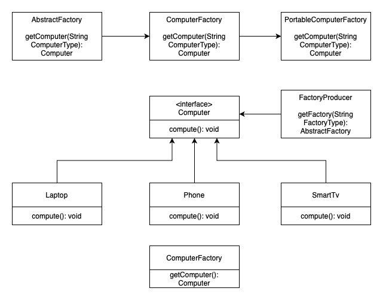

# Abstract Factory

### Table of Contents

* [Intent](#intent)
* [Problem](#problem)
* [Solution](#solution)
* [Structure](#structure)
* [When to use the abstract factory?](#when-to-use-the-abstract-factory?)
* [Diagram](#diagram)

### Intent
**Abstract Factory** is a creational design pattern that lets you produce families of related objects without specifying their concrete classes.

### Problem
If an application is to be portable, it needs to encapsulate platform dependencies. These "platforms" might include: windowing system, operating system, database, etc. Too often, this encapsulation is not engineered in advance, and lots of `#ifdef` case statements with options for all currently supported platforms begin to procreate like rabbits throughout the code.

### Solution
The first thing the Abstract Factory pattern suggests is to explicitly declare interfaces for each distinct product of the product family.  Then you can make all variants of products follow those interfaces.

### Structure
1. **Abstract Products** declare interfaces for a set of distinct but related products which make up a product family.
2. **Concrete Products** are various implementations of abstract products, grouped by variants. Each abstract product must be implemented in all given variants.
3. The **Abstract Factory** interface declares a set of methods for creating each of the abstract products.
4. **Concrete Factories** implement creation methods of the abstract factory. Each concrete factory corresponds to a specific variant of products and creates only those product variants.
5. Although concrete factories instantiate concrete products, signatures of their creation methods must return corresponding abstract products. This way the client code that uses a factory doesn’t get coupled to the specific variant of the product it gets from a factory. The **Client** can work with any concrete factory/product variant, as long as it communicates with their objects via abstract interfaces.

### When to use the abstract factory?
- When your code needs to work with various families of related products, but you don’t want it to depend on the concrete classes of those products—they might be unknown beforehand or you simply want to allow for future extensibility.

### Diagram

