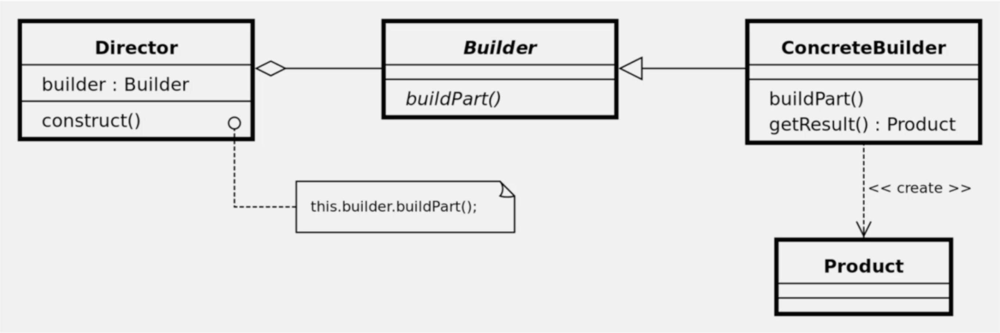

# Builder

### Table of Contents

* [Intent](#intent)
* [Problem](#problem)
* [Solution](#solution)
* [Structure](#structure)
* [When to use the builder pattern?](#when-to-use-the-builder-pattern?)
* [Diagram](#diagram)

### Intent
**Builder** is a creational design pattern that lets you construct complex objects step by step. The pattern allows you to produce different types and representations of an object using the same construction code.

### Problem
Imagine a complex object that requires laborious, step-by-step initialization of many fields and nested objects. Such initialization code is usually buried inside a monstrous constructor with lots of parameters. Or even worse: scattered all over the client code.

### Solution
The Builder pattern suggests the object construction code to be extracted out of its own class and moved to separate objects called *builders*.

### Structure
1. The **Builder** interface / inner class declares product construction steps that are common to all types of builders.
2. **Concrete Builders** provide different implementations of the construction steps. Concrete builders may produce products that don’t follow the common interface.
3. **Products** are resulting objects. Products constructed by different builders don’t have to belong to the same class hierarchy or interface.
4. The **Director** class defines the order in which to call construction steps, so you can create and reuse specific configurations of products.
5. The **Client** must associate one of the builder objects with the director.

### When to use the builder pattern?
- when dealing a complex object that requires a lot of parameters;
- when trying to prevent mistakes from creating a complex object;
- when trying to avoid unreadable, big constructors that are sometimes required for complex objects creation.

### Diagram
