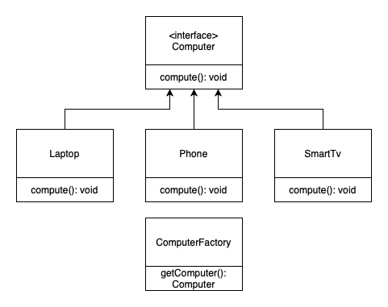

# Factory Method 
#### aka Virtual Constructor

### Table of Contents

* [Intent](#intent)
* [Problem](#problem)
* [Solution](#solution)
* [Structure](#structure)
* [When to use the Factory pattern?](#when-to-use-the-factory-pattern)
* [Advantages](#advantages)
* [Disadvantages](#disadvantages)
* [Diagram](#diagram)

### Intent
**Factory Method** is a creational design pattern that provides an interface for creating objects in a superclass, but allows subclasses to alter the type of objects that will be created.

### Problem
A framework needs to standardize the architectural model for a range of applications, but allow for individual applications to define their own domain objects and provide for their instantiation.

### Solution
The Factory Method pattern suggests that you replace direct object construction calls (using the `new` operator) with calls to a special *factory* method.

### Structure
1. The **Product** declares the interface, which is common to all objects that can be produced by the creator and its subclasses.
2. **Concrete Products** are different implementations of the product interface.
3. The **Creator** class declares the factory method that returns new product objects. It’s important that the return type of this method matches the product interface.
4. **Concrete Creators** override the base factory method so it returns a different type of product.

### When to use the Factory pattern?
- When you don’t know beforehand the exact types and dependencies of the objects your code should work with.
- When you want to provide users of your library or framework with a way to extend its internal components.
- When you want to save system resources by reusing existing objects instead of rebuilding them each time.

### Advantages
- Hides the internal logic of creating objects.
- Enables the programmer to add new different objects of the same type.

### Disadvantages
- The complexity of this pattern tends to be high.
- Cannot be refactored into.

### Diagram

