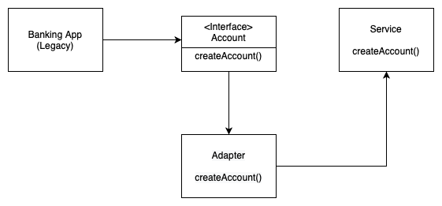

# Adapter
**aka Wrapper**

### Table of Contents

* [Intent](#intent)
* [Problem](#problem)
* [Solution](#solution)
* [Diagram](#diagram)
* [When to use the Adapter pattern?](#when-to-use-the-adapter-pattern)

### Intent

**Adapter** is a structural design pattern that allows objects with incompatible interfaces to collaborate.

### Problem

An "off the shelf" component offers compelling functionality that you would like to reuse, but its "view of the world" is not compatible with the philosophy and architecture of the system currently being developed.

### Solution

You can create an *adapter*. This is a special object that converts the interface of one object so that another object can understand it.

An adapter wraps one of the objects to hide the complexity of conversion happening behind the scenes. The wrapped object isn’t even aware of the adapter. For example, you can wrap an object that operates in meters and kilometers with an adapter that converts all of the data to imperial units such as feet and miles.

Adapters can not only convert data into various formats but can also help objects with different interfaces collaborate.

### Diagram

### When to use the Adapter pattern?

- In case of a legacy application;
- In case of converting an interface to another;
- In case of translating a client's request for a webservice;
- Within Java API, the pattern is used by **Arrays.asList()**, **I/O Streams**
