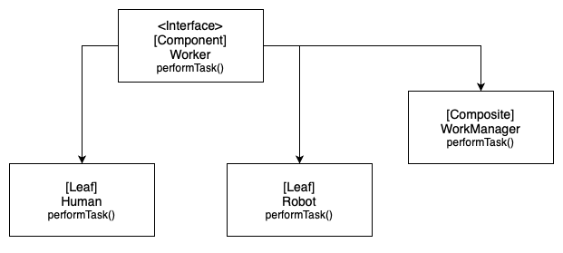

# Composite
**aka Object Tree**

### Table of Contents

* [Intent](#intent)
* [Problem](#problem)
* [Solution](#solution)
* [Diagram](#diagram)
* [Features](#features)
* [When to use the Composite pattern?](#when-to-use-the-composite-pattern)

### Intent

**Composite** is a structural design pattern that lets you compose objects into tree structures and then work with these structures as if they were individual objects.

### Problem

Application needs to manipulate a hierarchical collection of "primitive" and "composite" objects. Processing of a primitive object is handled one way, and processing of a composite object is handled differently. Having to query the "type" of each object before attempting to process it is not desirable.

### Solution

Define an abstract base class (Component) that specifies the behavior that needs to be exercised uniformly across all primitive and composite objects. Subclass the Primitive and Composite classes off of the Component class. Each Composite object "couples" itself only to the abstract type Component as it manages its "children".

### Diagram

### Features
- Designed on tree structure;
- Root level is the component;
- Leaf objects implement the component;
- Composite perform the same operations as the leaves;
- Composite knows about the child objects;
- Within Java API, the pattern is used by **java.awt.Component**

### When to use the Composite pattern?

- When has to be implemented a tree-like object structure;
- When want the client code to treat both simple and complex elements uniformly.
