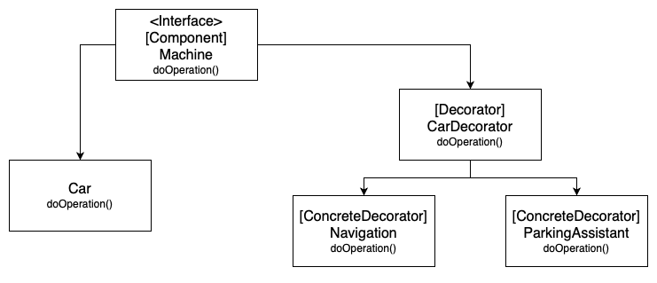

# Decorator
**aka Wrapper**

### Table of Contents

* [Intent](#intent)
* [Problem](#problem)
* [Solution](#solution)
* [Diagram](#diagram)
* [Features](#features)
* [When to use the Decorator pattern?](#when-to-use-the-decorator-pattern)

### Intent

**Decorator** is a structural design pattern that lets you attach new behaviors to objects by placing these objects inside special wrapper objects that contain the behaviors.

### Problem

You want to add behavior or state to individual objects at run-time. Inheritance is not feasible because it is static and applies to an entire class.

### Solution

The solution to this class of problems involves encapsulating the original object inside an abstract wrapper interface. Both the decorator objects and the core object inherit from this abstract interface. The interface uses recursive composition to allow an unlimited number of decorator "layers" to be added to each core object.

### Diagram

### Features

- Decorates a base object with multiple features;
- Adheres to the Single Responsibility Principle;
- Uses OOP principles.

### When to use the Decorator pattern?

- When is needed the ability to assign extra behaviors to objects at runtime without breaking the code that uses these objects.
