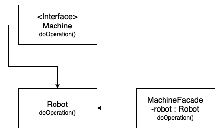

# Facade

### Table of Contents

* [Intent](#intent)
* [Problem](#problem)
* [Solution](#solution)
* [Diagram](#diagram)
* [When to use the Facade pattern?](#when-to-use-the-Facade-pattern)

### Intent

**Facade** is a structural design pattern that provides a simplified interface to a library, a framework, or any other complex set of classes.

### Problem

Imagine that you must make your code work with a broad set of objects that belong to a sophisticated library or framework. Ordinarily, you’d need to initialize all of those objects, keep track of dependencies, execute methods in the correct order, and so on.

As a result, the business logic of your classes would become tightly coupled to the implementation details of 3rd-party classes, making it hard to comprehend and maintain.

### Solution

A facade is a class that provides a simple interface to a complex subsystem which contains lots of moving parts. A facade might provide limited functionality in comparison to working with the subsystem directly. However, it includes only those features that clients really care about.

Having a facade is handy when you need to integrate your app with a sophisticated library that has dozens of features, but you just need a tiny bit of its functionality.

### Diagram

### When to use the Facade pattern?

- When it is needed to have a limited but straightforward interface to a complex subsystem;
- When it is wanted to structure a subsystem into layers.
