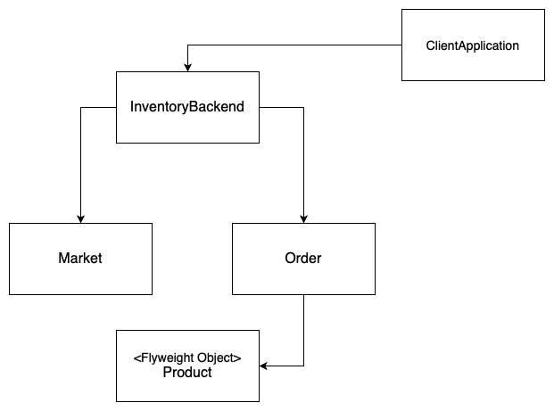

# Flyweight
**aka Cache**

### Table of Contents

* [Intent](#intent)
* [Problem](#problem)
* [Solution](#solution)
* [Diagram](#Diagram)
* [When to use the Flyweight pattern?](#when-to-use-the-Flyweight-pattern)

### Intent

**Flyweight** is a structural design pattern that lets you fit more objects into the available amount of RAM by sharing common parts of state between multiple objects instead of keeping all of the data in each object.

### Problem

Designing objects down to the lowest levels of system "granularity" provides optimal flexibility, but can be unacceptably expensive in terms of performance and memory usage.

### Solution

The Flyweight pattern describes how to share objects to allow their use at fine granularity without prohibitive cost. Each "flyweight" object is divided into two pieces: the **state-dependent** (**extrinsic**) part, and the **state-independent** (**intrinsic**) part. Intrinsic state is stored (shared) in the Flyweight object. Extrinsic state is stored or computed by client objects, and passed to the Flyweight when its operations are invoked.

### Diagram

### When to use the Flyweight pattern?

- Only when the program must support a huge number of objects which barely fit into available RAM.
