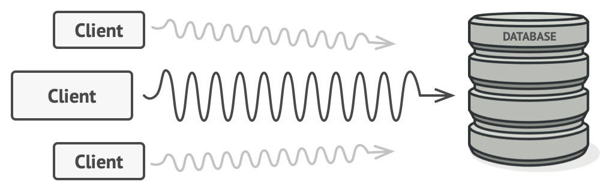

# Proxy

### Table of Contents

* [Intent](#intent)
* [Problem](#problem)
* [Solution](#solution)
* [Diagram](#diagram)
* [When to use the Proxy pattern?](#when-to-use-the-Proxy-pattern)

### Intent

**Proxy** is a structural design pattern that lets you provide a substitute or placeholder for another object. A proxy controls access to the original object, allowing you to perform something either before or after the request gets through to the original object.

### Problem

You need to support resource-hungry objects, and you do not want to instantiate such objects unless and until they are actually requested by the client.

*Example*: You have a massive object that consumes a vast amount of system resources. You need it from time to time, but not always.

### Solution

The Proxy pattern suggests that you create a new proxy class with the same interface as an original service object. Then you update your app so that it passes the proxy object to all of the original object’s clients. Upon receiving a request from a client, the proxy creates a real service object and delegates all the work to it.

### Diagram

### When to use the Proxy pattern?

- When creating a wrapper to cover main's object complexity;
- When creating a security layer for preventing unauthorized access.